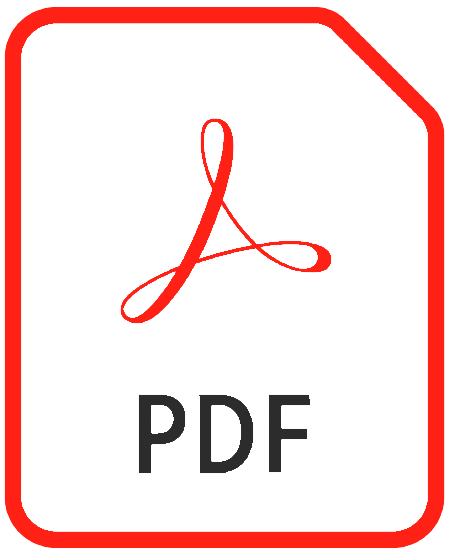

[Cadeler A/S](https://www.cadeler.com/) has been so kind to assign me my first project. The goal was to streamline their planning- and reporting process related to adverse weather conditions during operations with their jack-up vessels, used in the construction and commissioning of offshore windfarms. 
<!--more-->

The final product has the following top-level functionality:


graph LR;
    A(Graphical User Interface) --> | User input | C(Weather window calculations  according to DNV regulations)
    C --> report(Automated report generation)
    report --> word( )
    report --> pdf( )



graph TD;
    A(Graphical User Interface) --> | User input | C(Weather window calculations according to DNV regulations)
    C --> report(Automated report generation)
    report --> word( )
    report --> pdf( )


The GUI has the following extra functionalities:

- Complete input verification. The tool actively directs the user to faulty or incomplete inputs, also providing clear textual instructions through message boxes.
- Tooltips per input field, making the tool largely self-explained up to the level of the technical specifics.
- Mechanics to (automatically) save and load the complete state of GUI.
- The possibility to save (and delete) standard scenarios, to be straighforwardly inserted from within the GUI for an increased efficiency and ease of the workflow.
- Mechanics to share the user-defined save files and standard scnearios with other users. Likewise, the complete tool can be exported and automatically installed for receiving users.
- The tool comes with a manual for users and for developers.
 
 



The GUI is written in python using built-in Tkinter and [CustomTkinter](https://github.com/TomSchimansky/CustomTkinter), to obtain a clean and modern look. Any future GUI projects will however be written using [PySide](https://www.qt.io/qt-for-python), the LGPL-licensed official python binding of Qt. The tool's backend and GUI-integration are written using well-known python libraries such as numpy, matplotlib and PIL. Report generation is based on a template file, changed and imputed with the tool's inputs and outputs using [python-docx](https://github.com/python-openxml/python-docx). The tool is exported as a single-file executable using [PyInstaller](https://pyinstaller.org/en/stable/).

